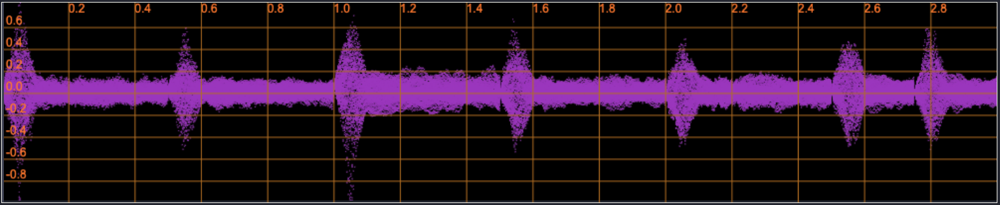

 

<h1>SynthCloner: Synthesizer Preset Conversion via Factorized Codec with Disentangled Timbre and ADSR Control</h1>

Jeng-Yue Liu1, 2, Ting-Chao Hsu1, Yen-Tung Yeh1, Li Su2, Yi-Hsuan Yang1

1 National Taiwan University

2 Academia Sinica

## Abstract

This collection presents 16 audio pairs for comprehensive evaluation of synthesizer preset conversion methods. Each pair contains 7 distinct audio files: original audio, reference audio, ground truth reconstruction, our proposed model output, ablation without ADSR extractor, CTD <a href="#note1" id="note1ref">[1]</a>, and SS-VQVAE <a href="#note2" id="note2ref">[2]</a>. This standardized framework enables detailed comparison of different audio reconstruction approaches across various content types. Code is available <a href="https://github.com/buffett0323/query_ss">here</a>.

 
Figure 1: SynthCloner model framework

## ADSR Definition

ADSR (Attack, Decay, Sustain, Release) is a fundamental envelope model in sound synthesis that shapes how a note evolves over time. As illustrated in Figure 2, this four-stage process controls the dynamic characteristics of synthesized sounds:

- **Attack**: The initial rising phase where sound reaches maximum amplitude from silence
- **Decay**: The descending phase where sound decreases from peak to sustain level  
- **Sustain**: The steady amplitude level maintained while the note is held (a level, not a time duration)
- **Release**: The final phase where sound fades back to silence after the note is released

Together, these stages give electronic instruments their dynamic and expressive qualities, mimicking the natural behavior of acoustic instruments.

 
Figure 2: Visualization of the ADSR envelope

## Preset Conversion Experiments with Audio Pairs

This section presents audio pairs from our preset conversion experiments, organized into three groups based on ADSR characteristics. Each pair includes: original audio, reference audio, ground-truth reconstruction, our proposed model output, ablation without ADSR extractor, CTD, and SS-VQVAE.

As shown in Figure 1, our model disentangles audio into three latent factors: ADSR, Content, and Timbre. In these experiments, we preserve the Content features from the original audio while replacing the ADSR and Timbre features with those from the reference audio. Specifically, if the original audio is represented as (e₁, c₁, t₁) and the reference as (e₂, c₂, t₂), the reconstructed output yields (e₂, c₁, t₂). The ablation study without the ADSR extractor demonstrates the critical importance of this component in our model architecture.

### Normal Cases

<table class="table table-sm text-center" style="vertical-align: middle;">
  <colgroup>
      <col style="width: 120px;">
      <col style="width: 160px;">
      <col style="width: 160px;">
      <col style="width: 160px;">
      <col style="width: 160px;">
      <col style="width: 160px;">
      <col style="width: 160px;">
      <col style="width: 160px;">
    </colgroup>
  <thead>
    <tr>
      <th style="text-align:center;">Pair ID</th>
      <th style="text-align:center;">Original</th>
      <th style="text-align:center;">Reference</th>
      <th style="text-align:center;">Ground Truth</th>
      <th style="text-align:center;">Propo<strong>Proposed</strong>sed</th>
      <th style="text-align:center;">w/o ADSR Extractor</th>
      <th style="text-align:center;">CTD</th>
      <th style="text-align:center;">SSVQVAE</th>
    </tr>
  </thead>
  <tbody>
    <tr>
      <td>Pair 1-1</td>
      <td><audio src="audios/01_orig.wav" controls style="width: 160px"></audio></td>
      <td><audio src="audios/01_ref.wav" controls style="width: 160px"></audio></td>
      <td><audio src="audios/01_gt.wav" controls style="width: 160px"></audio></td>
      <td><audio src="audios/01_recon_no_mask.wav" controls style="width: 160px"></audio></td>
      <td><audio src="audios/01_recon_abl.wav" controls style="width: 160px"></audio></td>
      <td><audio src="audios/01_recon_ctd.wav" controls style="width: 160px"></audio></td>
      <td><audio src="audios/01_recon_ssvqvae.wav" controls style="width: 160px"></audio></td>
    </tr>
    <tr>
      <td>Pair 1-2</td>
      <td><audio src="audios/02_orig.wav" controls style="width: 160px"></audio></td>
      <td><audio src="audios/02_ref.wav" controls style="width: 160px"></audio></td>
      <td><audio src="audios/02_gt.wav" controls style="width: 160px"></audio></td>
      <td><audio src="audios/02_recon_no_mask.wav" controls style="width: 160px"></audio></td>
      <td><audio src="audios/02_recon_abl.wav" controls style="width: 160px"></audio></td>
      <td><audio src="audios/02_recon_ctd.wav" controls style="width: 160px"></audio></td>
      <td><audio src="audios/02_recon_ssvqvae.wav" controls style="width: 160px"></audio></td>
    </tr>
    <tr>
      <td>Pair 1-3</td>
      <td><audio src="audios/03_orig.wav" controls style="width: 160px"></audio></td>
      <td><audio src="audios/03_ref.wav" controls style="width: 160px"></audio></td>
      <td><audio src="audios/03_gt.wav" controls style="width: 160px"></audio></td>
      <td><audio src="audios/03_recon_no_mask.wav" controls style="width: 160px"></audio></td>
      <td><audio src="audios/03_recon_abl.wav" controls style="width: 160px"></audio></td>
      <td><audio src="audios/03_recon_ctd.wav" controls style="width: 160px"></audio></td>
      <td><audio src="audios/03_recon_ssvqvae.wav" controls style="width: 160px"></audio></td>
    </tr>
    <tr>
      <td>Pair 1-4</td>
      <td><audio src="audios/06_orig.wav" controls style="width: 160px"></audio></td>
      <td><audio src="audios/06_ref.wav" controls style="width: 160px"></audio></td>
      <td><audio src="audios/06_gt.wav" controls style="width: 160px"></audio></td>
      <td><audio src="audios/06_recon_no_mask.wav" controls style="width: 160px"></audio></td>
      <td><audio src="audios/06_recon_abl.wav" controls style="width: 160px"></audio></td>
      <td><audio src="audios/06_recon_ctd.wav" controls style="width: 160px"></audio></td>
      <td><audio src="audios/06_recon_ssvqvae.wav" controls style="width: 160px"></audio></td>
    </tr>
    <tr>
      <td>Pair 1-5</td>
      <td><audio src="audios/08_orig.wav" controls style="width: 160px"></audio></td>
      <td><audio src="audios/08_ref.wav" controls style="width: 160px"></audio></td>
      <td><audio src="audios/08_gt.wav" controls style="width: 160px"></audio></td>
      <td><audio src="audios/08_recon_no_mask.wav" controls style="width: 160px"></audio></td>
      <td><audio src="audios/08_recon_abl.wav" controls style="width: 160px"></audio></td>
      <td><audio src="audios/08_recon_ctd.wav" controls style="width: 160px"></audio></td>
      <td><audio src="audios/08_recon_ssvqvae.wav" controls style="width: 160px"></audio></td>
    </tr>
    <tr>
      <td>Pair 1-6</td>
      <td><audio src="audios/10_orig.wav" controls style="width: 160px"></audio></td>
      <td><audio src="audios/10_ref.wav" controls style="width: 160px"></audio></td>
      <td><audio src="audios/10_gt.wav" controls style="width: 160px"></audio></td>
      <td><audio src="audios/10_recon_no_mask.wav" controls style="width: 160px"></audio></td>
      <td><audio src="audios/10_recon_abl.wav" controls style="width: 160px"></audio></td>
      <td><audio src="audios/10_recon_ctd.wav" controls style="width: 160px"></audio></td>
      <td><audio src="audios/10_recon_ssvqvae.wav" controls style="width: 160px"></audio></td>
    </tr>
    <tr>
      <td>Pair 1-7</td>
      <td><audio src="audios/11_orig.wav" controls style="width: 160px"></audio></td>
      <td><audio src="audios/11_ref.wav" controls style="width: 160px"></audio></td>
      <td><audio src="audios/11_gt.wav" controls style="width: 160px"></audio></td>
      <td><audio src="audios/11_recon_no_mask.wav" controls style="width: 160px"></audio></td>
      <td><audio src="audios/11_recon_abl.wav" controls style="width: 160px"></audio></td>
      <td><audio src="audios/11_recon_ctd.wav" controls style="width: 160px"></audio></td>
      <td><audio src="audios/11_recon_ssvqvae.wav" controls style="width: 160px"></audio></td>
    </tr>
    <tr>
      <td>Pair 1-8</td>
      <td><audio src="audios/12_orig.wav" controls style="width: 160px"></audio></td>
      <td><audio src="audios/12_ref.wav" controls style="width: 160px"></audio></td>
      <td><audio src="audios/12_gt.wav" controls style="width: 160px"></audio></td>
      <td><audio src="audios/12_recon_no_mask.wav" controls style="width: 160px"></audio></td>
      <td><audio src="audios/12_recon_abl.wav" controls style="width: 160px"></audio></td>
      <td><audio src="audios/12_recon_ctd.wav" controls style="width: 160px"></audio></td>
      <td><audio src="audios/12_recon_ssvqvae.wav" controls style="width: 160px"></audio></td>
    </tr>
    <tr>
      <td>Pair 1-9</td>
      <td><audio src="audios/13_orig.wav" controls style="width: 160px"></audio></td>
      <td><audio src="audios/13_ref.wav" controls style="width: 160px"></audio></td>
      <td><audio src="audios/13_gt.wav" controls style="width: 160px"></audio></td>
      <td><audio src="audios/13_recon_no_mask.wav" controls style="width: 160px"></audio></td>
      <td><audio src="audios/13_recon_abl.wav" controls style="width: 160px"></audio></td>
      <td><audio src="audios/13_recon_ctd.wav" controls style="width: 160px"></audio></td>
      <td><audio src="audios/13_recon_ssvqvae.wav" controls style="width: 160px"></audio></td>
    </tr>
    <tr>
      <td>Pair 1-10</td>
      <td><audio src="audios/14_orig.wav" controls style="width: 160px"></audio></td>
      <td><audio src="audios/14_ref.wav" controls style="width: 160px"></audio></td>
      <td><audio src="audios/14_gt.wav" controls style="width: 160px"></audio></td>
      <td><audio src="audios/14_recon_no_mask.wav" controls style="width: 160px"></audio></td>
      <td><audio src="audios/14_recon_abl.wav" controls style="width: 160px"></audio></td>
      <td><audio src="audios/14_recon_ctd.wav" controls style="width: 160px"></audio></td>
      <td><audio src="audios/14_recon_ssvqvae.wav" controls style="width: 160px"></audio></td>
    </tr>
  </tbody>
</table>

### Short2Long

<table class="table table-sm text-center" style="vertical-align: middle;">
  <colgroup>
      <col style="width: 120px;">
      <col style="width: 160px;">
      <col style="width: 160px;">
      <col style="width: 160px;">
      <col style="width: 160px;">
      <col style="width: 160px;">
      <col style="width: 160px;">
      <col style="width: 160px;">
    </colgroup>
  <thead>
    <tr>
      <th style="text-align:center;">Pair ID</th>
      <th style="text-align:center;">Original</th>
      <th style="text-align:center;">Reference</th>
      <th style="text-align:center;">Ground Truth</th>
      <th style="text-align:center;"><strong>Proposed</strong></th>
      <th style="text-align:center;">w/o ADSR Extractor</th>
      <th style="text-align:center;">CTD</th>
      <th style="text-align:center;">SSVQVAE</th>
    </tr>
  </thead>
  <tbody>
    <tr>
      <td>Pair 2-1</td>
      <td><audio src="audios/04_orig.wav" controls style="width: 160px"></audio></td>
      <td><audio src="audios/04_ref.wav" controls style="width: 160px"></audio></td>
      <td><audio src="audios/04_gt.wav" controls style="width: 160px"></audio></td>
      <td><audio src="audios/04_recon_no_mask.wav" controls style="width: 160px"></audio></td>
      <td><audio src="audios/04_recon_abl.wav" controls style="width: 160px"></audio></td>
      <td><audio src="audios/04_recon_ctd.wav" controls style="width: 160px"></audio></td>
      <td><audio src="audios/04_recon_ssvqvae.wav" controls style="width: 160px"></audio></td>
    </tr>
    <tr>
      <td>Pair 2-2</td>
      <td><audio src="audios/07_orig.wav" controls style="width: 160px"></audio></td>
      <td><audio src="audios/07_ref.wav" controls style="width: 160px"></audio></td>
      <td><audio src="audios/07_gt.wav" controls style="width: 160px"></audio></td>
      <td><audio src="audios/07_recon_no_mask.wav" controls style="width: 160px"></audio></td>
      <td><audio src="audios/07_recon_abl.wav" controls style="width: 160px"></audio></td>
      <td><audio src="audios/07_recon_ctd.wav" controls style="width: 160px"></audio></td>
      <td><audio src="audios/07_recon_ssvqvae.wav" controls style="width: 160px"></audio></td>
    </tr>
    <tr>
      <td>Pair 2-3</td>
      <td><audio src="audios/09_orig.wav" controls style="width: 160px"></audio></td>
      <td><audio src="audios/09_ref.wav" controls style="width: 160px"></audio></td>
      <td><audio src="audios/09_gt.wav" controls style="width: 160px"></audio></td>
      <td><audio src="audios/09_recon_no_mask.wav" controls style="width: 160px"></audio></td>
      <td><audio src="audios/09_recon_abl.wav" controls style="width: 160px"></audio></td>
      <td><audio src="audios/09_recon_ctd.wav" controls style="width: 160px"></audio></td>
      <td><audio src="audios/09_recon_ssvqvae.wav" controls style="width: 160px"></audio></td>
    </tr>
    <tr>
      <td>Pair 2-4</td>
      <td><audio src="audios/15_orig.wav" controls style="width: 160px"></audio></td>
      <td><audio src="audios/15_ref.wav" controls style="width: 160px"></audio></td>
      <td><audio src="audios/15_gt.wav" controls style="width: 160px"></audio></td>
      <td><audio src="audios/15_recon_no_mask.wav" controls style="width: 160px"></audio></td>
      <td><audio src="audios/15_recon_abl.wav" controls style="width: 160px"></audio></td>
      <td><audio src="audios/15_recon_ctd.wav" controls style="width: 160px"></audio></td>
      <td><audio src="audios/15_recon_ssvqvae.wav" controls style="width: 160px"></audio></td>
    </tr>
  </tbody>
</table>

### Long2Short

<table class="table table-sm text-center" style="vertical-align: middle;">
  <colgroup>
      <col style="width: 120px;">
      <col style="width: 160px;">
      <col style="width: 160px;">
      <col style="width: 160px;">
      <col style="width: 160px;">
      <col style="width: 160px;">
      <col style="width: 160px;">
      <col style="width: 160px;">
    </colgroup>
  <thead>
    <tr>
      <th style="text-align:center;">Pair ID</th>
      <th style="text-align:center;">Original</th>
      <th style="text-align:center;">Reference</th>
      <th style="text-align:center;">Ground Truth</th>
      <th style="text-align:center;"><strong>Proposed</strong></th>
      <th style="text-align:center;">w/o ADSR Extractor</th>
      <th style="text-align:center;">CTD</th>
      <th style="text-align:center;">SSVQVAE</th>
    </tr>
  </thead>
  <tbody>
    <tr>
      <td>Pair 3-1</td>
      <td><audio src="audios/05_orig.wav" controls style="width: 160px"></audio></td>
      <td><audio src="audios/05_ref.wav" controls style="width: 160px"></audio></td>
      <td><audio src="audios/05_gt.wav" controls style="width: 160px"></audio></td>
      <td><audio src="audios/05_recon_no_mask.wav" controls style="width: 160px"></audio></td>
      <td><audio src="audios/05_recon_abl.wav" controls style="width: 160px"></audio></td>
      <td><audio src="audios/05_recon_ctd.wav" controls style="width: 160px"></audio></td>
      <td><audio src="audios/05_recon_ssvqvae.wav" controls style="width: 160px"></audio></td>
    </tr>
    <tr>
      <td>Pair 3-2</td>
      <td><audio src="audios/16_orig.wav" controls style="width: 160px"></audio></td>
      <td><audio src="audios/16_ref.wav" controls style="width: 160px"></audio></td>
      <td><audio src="audios/16_gt.wav" controls style="width: 160px"></audio></td>
      <td><audio src="audios/16_recon_no_mask.wav" controls style="width: 160px"></audio></td>
      <td><audio src="audios/16_recon_abl.wav" controls style="width: 160px"></audio></td>
      <td><audio src="audios/16_recon_ctd.wav" controls style="width: 160px"></audio></td>
      <td><audio src="audios/16_recon_ssvqvae.wav" controls style="width: 160px"></audio></td>
    </tr>
  </tbody>
</table>

## Timbre/ADSR Disentanglement Control

This section demonstrates our model's disentanglement control capabilities, showcasing how ADSR and timbre characteristics can be independently manipulated while preserving other audio properties. Each example presents the original audio, reference audio, and converted audio with their corresponding visual representations.

### ADSR Control Example 1

  

    <strong>Example 1 (Audio)</strong> 
    <audio controls style="width: 100%; max-width: 300px; height: 40px;">
      <source src="control_audios/conv_adsr/02_orig.wav" type="audio/wav">
      Your browser does not support the audio element.
    </audio>
  

  

    <strong>Example 1 (Image)</strong> 
    
  

  

    <strong>Example 1 (Audio)</strong> 
    <audio controls style="width: 100%; max-width: 300px; height: 40px;">
      <source src="control_audios/conv_adsr/02_ref.wav" type="audio/wav">
      Your browser does not support the audio element.
    </audio>
  

  

    <strong>Example 1 (Image)</strong> 
    
  

  

    <strong>Example 1 (Audio)</strong> 
    <audio controls style="width: 100%; max-width: 300px; height: 40px;">
      <source src="control_audios/conv_adsr/02_adsr.wav" type="audio/wav">
      Your browser does not support the audio element.
    </audio>
  

  

    <strong>Example 1 (Image)</strong> 
    
  

<!-- *Note: The audio players are positioned above their corresponding images for easy comparison. The converted audio demonstrates ADSR control while maintaining other audio characteristics.* -->

### ADSR Control Example 2

  

    <strong>Example 2 (Audio)</strong> 
    <audio controls style="width: 100%; max-width: 300px; height: 40px;">
      <source src="control_audios/conv_adsr/04_orig.wav" type="audio/wav">
      Your browser does not support the audio element.
    </audio>
  

  

    <strong>Example 2 (Image)</strong> 
    
  

  

    <strong>Example 2 (Audio)</strong> 
    <audio controls style="width: 100%; max-width: 300px; height: 40px;">
      <source src="control_audios/conv_adsr/04_ref.wav" type="audio/wav">
      Your browser does not support the audio element.
    </audio>
  

  

    <strong>Example 2 (Image)</strong> 
    
  

  

    <strong>Example 2 (Audio)</strong> 
    <audio controls style="width: 100%; max-width: 300px; height: 40px;">
      <source src="control_audios/conv_adsr/04_adsr.wav" type="audio/wav">
      Your browser does not support the audio element.
    </audio>
  

  

    <strong>Example 2 (Image)</strong> 
    
  

### ADSR Control Example 3

  

    <strong>Example 3 (Audio)</strong> 
    <audio controls style="width: 100%; max-width: 300px; height: 40px;">
      <source src="control_audios/conv_adsr/07_orig.wav" type="audio/wav">
      Your browser does not support the audio element.
    </audio>
  

  

    <strong>Example 3 (Image)</strong> 
    
  

  

    <strong>Example 3 (Audio)</strong> 
    <audio controls style="width: 100%; max-width: 300px; height: 40px;">
      <source src="control_audios/conv_adsr/07_ref.wav" type="audio/wav">
      Your browser does not support the audio element.
    </audio>
  

  

    <strong>Example 3 (Image)</strong> 
    
  

  

    <strong>Example 3 (Audio)</strong> 
    <audio controls style="width: 100%; max-width: 300px; height: 40px;">
      <source src="control_audios/conv_adsr/07_adsr.wav" type="audio/wav">
      Your browser does not support the audio element.
    </audio>
  

  

    <strong>Example 3 (Image)</strong> 
    
  

<!-- ## Timbre Control Examples

This section demonstrates the timbre control capabilities of our model, showing how timbre characteristics can be manipulated while preserving other audio properties. -->

### Timbre Control Example 1

  

    <strong>Example 1 (Audio)</strong> 
    <audio controls style="width: 100%; max-width: 300px; height: 40px;">
      <source src="control_audios/conv_timbre/01_orig.wav" type="audio/wav">
      Your browser does not support the audio element.
    </audio>
  

  

    <strong>Example 1 (Image)</strong> 
    
  

  

    <strong>Example 1 (Audio)</strong> 
    <audio controls style="width: 100%; max-width: 300px; height: 40px;">
      <source src="control_audios/conv_timbre/01_ref.wav" type="audio/wav">
      Your browser does not support the audio element.
    </audio>
  

  

    <strong>Example 1 (Image)</strong> 
    
  

  

    <strong>Example 1 (Audio)</strong> 
    <audio controls style="width: 100%; max-width: 300px; height: 40px;">
      <source src="control_audios/conv_timbre/01_timbre.wav" type="audio/wav">
      Your browser does not support the audio element.
    </audio>
  

  

    <strong>Example 1 (Image)</strong> 
    
  

### Timbre Control Example 2

  

    <strong>Example 2 (Audio)</strong> 
    <audio controls style="width: 100%; max-width: 300px; height: 40px;">
      <source src="control_audios/conv_timbre/02_orig.wav" type="audio/wav">
      Your browser does not support the audio element.
    </audio>
  

  

    <strong>Example 2 (Image)</strong> 
    
  

  

    <strong>Example 2 (Audio)</strong> 
    <audio controls style="width: 100%; max-width: 300px; height: 40px;">
      <source src="control_audios/conv_timbre/02_ref.wav" type="audio/wav">
      Your browser does not support the audio element.
    </audio>
  

  

    <strong>Example 2 (Image)</strong> 
    
  

  

    <strong>Example 2 (Audio)</strong> 
    <audio controls style="width: 100%; max-width: 300px; height: 40px;">
      <source src="control_audios/conv_timbre/02_timbre.wav" type="audio/wav">
      Your browser does not support the audio element.
    </audio>
  

  

    <strong>Example 2 (Image)</strong> 
    
  

<!-- *Note: The audio players are positioned above their corresponding images for easy comparison. The converted audio demonstrates timbre control while maintaining other audio characteristics.* -->

## References 

<a id="note1" href="#note1ref">[1]</a> N. Demerlé, P. Esling, G. Doras, and D. Genova, “Combining audio control and style transfer using latent diffusion,” in Proc. International Society for Music Information Retrieval (ISMIR), 2024

<a id="note2" href="#note2ref">[2]</a> O. Cífka, A. Ozerov, U.  ̧Sim ̧sekli, and G. Richard “Self-supervised vq-vae for one-shot music style transfer,” in ICASSP 2021-2021 IEEE International Conference on Acoustics, Speech and Signal Processin(ICASSP). IEEE, 2021, pp. 96–100
